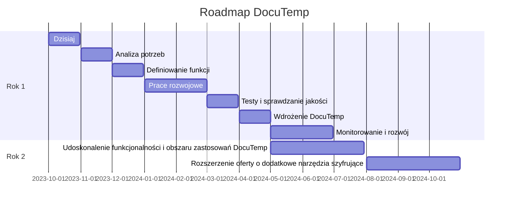
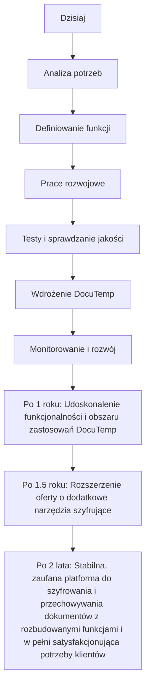

# docs.docutemp.com

DocuTemp to bezpieczne i wydajne rozwiązanie do szyfrowania i przechowywania dokumentów projektowych w jednym dokumencie HTML, co czyni go idealnym wyborem dla firm wymieniających wrażliwe dane i stanowi silną alternatywę dla polegania na serwerach centralnych lub zewnętrznych aplikacjach do przechowywania i szyfrowania danych.

Do czego służy? 
+ szyfruje i przechowuje dokumenty projektu w jednym pliku html.

Dla kogo?
+ firm i osób, które potrzebują bezpiecznie wymieniać wrażliwe informacje przez popularne komunikatory.

Alternatywa?
+ dla tradycyjnych metod polegających na korzystaniu z centralnych serwerów lub zewnętrznych aplikacji do przechowywania danych i szyfrowania.

--- 
EN

DocuTemp is a secure and efficient solution for encrypting and storing project documents in a single HTML document, making it an perfect choice for businesses that exchange sensitive data and is a strong alternative to relying on central servers or external applications for data storage and encryption.

What it does? 
+ DocuTemp encrypts and stores project documents in a single html file.

Who it's for? 
+ It's designed for businesses and individuals who need to exchange sensitive data securely.

Alternative to?
+ DocuTemp is a compelling alternative to conventional methods that rely on central servers or external applications for data storage and encryption.

### Możliwości DocuTemp:

- Wymiana danych z księgowym, faktur, raportów, danych medycznych, pracowników bez obawy o ich utratę czy wyciek do osób niepowołanych
- Podpisywanie i monitorowanie realizacji umów asynchronicznie, bez konieczności utrzymywania stałego połączenia
- Archiwizacja danych, umożliwiająca bezpieczne przenoszenie między różnymi urządzeniami, np.: PC i USB
- Możliwość korzystania z mniej bezpiecznych kanałów komunikacji wysyłając dane wrażliwe w postaci zaszyfrowanej

### Jakie korzyści przyniesie Wam DocuTemp?

- Dostęp do wszystkich dokumentów w jednym przenośnym pliku html, to większy porządek i łatwość w zarządzaniu danymi.
- Pełna kontrola - wszystko jest w 100% w Państwa rękach - nie jest wymagany centralny serwer do przechowywania danych i haseł.
- DocuTemp działaj na każdym systemie operacyjnym i przeglądarce, a edycja danych jest możliwa bezpośrednio w przeglądarce internetowej bez potrzeby instalowania zewnętrznych aplikacji.

DocuTemp to przede wszystkim bezpieczeństwo - wszystko odbywa się po stronie przeglądarki w języku JavaScript, a dokumenty są przechowywane w formacie HTML, co gwarantuje niezależność od zewnętrznych aplikacji.

W DocuTemp zapewniamy pełne bezpieczeństwo wymiany danych, archiwizacji dokumentów czy realizacji usług. Podejmujemy wszelkie działania, aby unikać ryzyka wycieku informacji - ograniczamy ryzyko do minimum, dzięki czemu można skupić się wyłącznie na realizacji swoich celów biznesowych.

### Zastosowanie:

Za sprawą DocuTemp można realizować prace wymagające dostępu do wrażliwych danych w pełni zdalnie, bez obaw o wyciek danych, kompromitację, kary (RODO).
Od bezpiecznej pracy zdalnej po delegowanie zadań monotematycznych czy wymianę dokumentów, DocuTemp to klucz do skutecznego, szyfrowanego i bezpiecznego zarządzania dokumentami w Państwa firmie.

## Oferta

### Rozwiązanie:

+ szyfrowanie i przechowywanie dokumentów projektu w jednym dokumencie html

### Cel:
+ do wymiany danych w formie zaszyfrowanej
+ do realizacja usług w sposób asynchroniczny

  
### Zastosowanie:
+ Wymiana danych z księgowym, faktur, raportów, danych medycznych, pracowników
+ Podpisywanie i monitorowanie realizacji umów asyncrhoczninie (i syncrhonicznie na serwerze)
+ Archiwizajca danych, np. przenoszenie między PC i USB danych w formie zaszyfrowanej
+ mozliwosc korzystania z mniej bezpiecznych kanalow komunikacji wysyłając dane wrażliwe w postaci zaszyfrowanej

  
### Korzyści
+ jeden przenośny dokument jako portfel dla wielu dokumentów
+ bez centralnego serwera przechowującego dane i hasła
+ Kontrola zmian, danych
+ działa na każdego platformie i przeglądarce
+ edycja danych bezpośrednio w przeglądarce internetowej bez zewnętrznej aplikacji

  
### Specyfikacja:

+ dokument w formacie HTML, dlatego nie wymaga zewnętrznej aplikacji
+ aktywne elementy i szyfrowanie obsługiwane po stronie przeglądarki w języku JavaScript
+ możliwość synchronizacji z zewnętrznymi i lokalnymi usługami na serwerze, komputerze użytkownik, np. w celu aktualizacji statusu kontraktu
+ możliwość załączenia i uruchomienia w komunikatorze do przeglądu lub edycji w prywatnym oknie

## Historia powstania
Szukając rozwiązania dla wymiany danych z księgowym, znalazłem webowe narzędzia do  szayfrowania plików:

+ [Hat.sh - Simple, fast, secure client-side file encryption](https://hat.sh/)
+ [DocuCrypt - ENCRYPTS & DECRYPTS YOUR PRIVATE FILES](https://www.docu-crypt.com/)

Oprócz szyfrowania danych przesyłanych między dwoma komputerami/osobami, chciałem automatyzować zbieranie faktur z emaili i stron www providerów online.
+ nie da się tego zrobić za pomocą dostępu do API, bo nie każdy provider usług online ma takie rozwiązanie

dlatego trzeba to zrobić ręcznie ...
+ i jak to zrobić nie znając haseł do tych providerów?

### Realizacja usługi online
+ umawiam się na 15minut na sesję remote desktop, czyli osoba udostępniająca PC ma pełen wgląd co robię i daje mi tylko prawo do przeglądarki, bez możliwosci przesyłania danych pomiędzy komputerami
+ manualnie łącze się do komputera sekretarki, na którym są przechowywane hasła dostępowe (password manager) do listy serwisów, które powinny zaiwerać np. dokumenty, faktury
+ zbieram te dane do jednego pliku html lokalnie i zabezpieczam hasłem, po czym wysyłam poprzez email (edykowany do faktur), lub zostawiam na dysku komputera

tak wygląda to dziś, w przyszłości można to w pełni zautomatyzować
sensem tego rozwiązania jest makysmalne ograniczenie ryzyka przy pracach wymagających dostępu do wrażliwych danych, aby dziś oferować usługę automatyzacji, bez potrzeby pytania o hasła

to tylko przykład jednego z zadań, które wymaga wejścia na czyiś komputer w sposób bezpieczniejszy, tzn bez prawa do używania dysku i tylko jednej aplikacji - przeglądarki www z już zapisanymi hasłami, więc ja mogę używać np. Firefox z zapisanymi hasłami i nie będę w stanie podejrzeć tych danych, bo są zabezpieczane password master
z drugiej strony mogę korzystać z sieci i myszki (bo klawiatura nie jest potrzebna)

bo hasło i tak wpisuje osoba dla której to robię, ja tylko występuje w formie BOTa do klikania w odpowiednie linki i zapisywania danych na dysk komputera klienta i na nim upload do dokumentu w którym będą przechowywane te zaszyfrowane już pliki do wysyłki

### Outsourcing
Tego typu zadani może robić osoba z firmy, ale dzięki szyfrowaniu może być prowadzony bezpieczny outsource sekretarki i księgowego w takiej klikającej formie jeśli mowa o zasobach wrażliwych
zyskujesz szybką realizację takich monotonnych zadań bez ryzyka, że ktoś będzie miał dostęp do danych wrażliwych

### Checklist'a
monitorowanie wykonania zadania w czasie rzeczywistym
W dokumencie HTML znajduje się checklista z linkami i jeśli wszystko zostanie powyklikane, pobrane i załadowane do postaci zaszyfrowanej to trafia do ksiegowego lub w inne miejsce też w takiej formie w dowolny sposób.

### Praca grupowa

Aktualnie są dwie strony kontraktu, ale mozna to poszerzyc do 3-4 i wowczas kazdy bedzie odpowiedzialny za swoja checkliste
takie rozwiązanie otwiera mozliwości realizacji customizowanych usług, ktróe można monitorować, bo to czy kliknąłeś link i uploadowałeś go krok po kroku można sprawdzić
bo pozostaną metadane i ta checklista wbudowana w ten dokument moze byc wysyalana na serwer, aby podejrzec stan jesli ktoś z zewnątrz chciałby wiedzieć, np wlasciceil firmy, czy dokumenty zostaly pobrane i wyslane, bo potem ten dokument moze otworzyc księgowy i potwierdzić ze odebrał

### Usprawnienia
do tego celu można też udostępnić specjalny komputer w firmie, w ramach zwiększania bezpieczeństwa i go wpinać jak jest potrzebny
można poszerzyć zakres usług i nawet podpinać synchronizację z księgowymi i być partnerem wielu księgowych

## Bezpieczna wymiana dokumentów

Szyfrowanie kanałów komunikacji to minimum do którego przywykliśmy.
Niestety nie zawsze to wystarczy, zwłaszcza gdy możemy stać się ofiarą luki w oprogramowaniu, np. backdoory czy ciągłej infiltracji ze strony rządu polegającej na archiwizownaiu wiadomości przez providerów usług komunikacji.

Przechowywanie danych na prywatnym urządzeniu pc, smartphone czy pendrive z podaniem hasła dostępu do całego systemu czy dysku może nie być wystarczające, jeśli dostęp do urządzenia ma strona trzecia poprzez celowo pozostawione luki w systemie.

To co może pomóc w takich skrajnych, ale zdarzających się sytuacjach, to pozostawianie danych w formie zaszyfrowanej na dysku, nawet wtedy gdy system jest zabezpieczony hasłem.

W sytuacji zagrożenia życia, takie różnice pomagają w zachowaniu życiua swojego i innych osób narażonych na wyciek danych.

Na co dzień jednak nie chcemy aby the luki bezpieczeństwa pozwalałby na dostęp konkurencji, czy grup posuwających się do przestępstwa i łamania tajemnicy korespondencji gwarantowanej nam w konstytucji.

## Oferta

FinOfficer to narzędzie do transparentnej dla obu stron komunikacji a zarazem szyfrowanej dla osób postronnych.
Komunikacja może odbywać się za pomocą dowolnego medium, ale sama treść wiadomości i załączników może zostać zaszyfrowana.

Taka forma komunikacja wymaga prostego narzędzia dlatego korzystamy z narzędzia DocuTemp do tworzenia dokumentów w locie z szyfrowaniem.
   
Plik który przesyłamy w koresponendcji jest formacie HTML a do otwarcia wymaga tylko przeglądarki i hasła, po  realizacji zdalnych usług

+ Szyfrowanie to tylko warstwa niezalezna od kanalu komunikacji
+ Plik HTML to typ MIME multipart z plikami wbudowanymi do html

## Zastosowanie

+ tworzenie umów pod customizowane pod klienta usługi online/offline
+ Wbudowana checklista kolejnych kroków, potwierdzanych przez zlecającego wykonanie usług
+ Potem edycja i ponowne zapisanie, zaszyfrowanie i wyslanie zmian
+ Możliwość przechowywania zaszyfrowanego pliku w jednorazowym sejfie

HTML multipart zawiera wbudowanych w html dowolne pliki projektu potrzebnego do realizacji usługi: png, doc, png, md, ...

Chodzi o to by na dysku nie bylo sladu po sourcode, zeby te wazne pliki byly wbudowane wewnatrz html w sposob zaszyfrowany i tylko otworzenie dokumentu w przegladarce pozwoli na zobaczenie co tam jest po podaniu hasla
Taki dokument zaszyfrowany html ma miec tez niezaszyfrowane dane jak status do umowy
Czyli Ty mi wysylasz zlecenie, umowe w formacie html z checklista, ja odbieram i poprzrz wygenerowany klucz otwieram dodaje pliki poprzez funcke upload i wysylam Tobie zaznaczajac zmiane statusu i rozpoczecie kolejnego etapu
Ty odbierasz html z zalacznikami w nim i po otrzymaniu klucza otwierasz i potwierdzasz lub nie ten etap, zalaczasz jakies wskazowki i plik znowu wraca do mnie, na koniec jak wszystkie checkbosy statusu zlecenia beda zaznaczone i potwierdzone jako zweryfikowane automatycznie wysylasz kase z depozytu
Chodzi o to by kontrolowac przebieg prac nad projektem i nie zmieniac kryteriow wykonania w trakcie, aby byla to transparenta umowa dla obu stron
Ta checklista aktualnie zapisuje sie w cookies i jesli jest dostepny na zdalnym serwerze, ale sam dokument nie jest przechowywany na serwerze
Jedynie template
A co pomiedzy sie w nim zmiesci nie jest nikomu znane Oprocz dwom stronom umowy

# Use Case

## Kontrakt

Chodzi o mozliwosc korzystania z mniej bezpiecznych komunikacji informacji do celow zawierania umów i rozliczania, bez udzialu strony trzeciej, ktora udostepnia templates i hash do aktualizacji statusu, bez ktorego nie mozna samowolnie przejsc do nastepnego etapu
Osoba ktore zleca odpowiada za weryfikacje prac dlatego ona potwierdza checkliste i decyduje o wyplacie dlatego mozna tez zrobic umowe z wyplata zaliczek po zmianie kolejnych statusow
W tej chwili zakladam dwie strony umowy ale moze bedzie potrzebna rozbudowa
To moze dzialac online ale w skrajnosci musi byc mozliwosc pracowania na pliku offline bez dostepu do danych na urzadzeniu

## Fiverr

Korzystam z fiverr i tam jest chat, ja bym chcial aby to bylo w formie offline bez chatu a po prostu spakowana paczka na wszystko co da sie zdalnie wykonac

## Księgowość, wymiana dokumentów

To samo z moim ksiegowym
Nie chce by posiadal moje dokumenty na dysku w formie niezaszyfrowanej
Dlatego chce mu wysylac taka paczke do pobrania np z jednorazowego linku
Żebym tez mial informacje czy pobral w statusie dokumentu jaki mam u siebie
Wiec jesli bede chcial mu wyslac wiele dokumentow to bedzie mogl sobie to pobrac z linku i otworzyc na kompie a potem pokasować jak juz wprowadzi do systemu
Bo jak widze z jakich oni korzystaja klientow poczty
Np. o2, wp,...

## Usługa Sejf

+ Możliwość przechowywania zaszyfrowanego pliku w jednorazowym sejfie
to znaczy, że można zaszyfrowany dokument upload-ować aby druga osoba po podaniu hasła mogła go pobrać
Skrytka w tym momencie zostaje usunięta z serwera.
a dokument pozostaje u nadającego i odbierającego.
Nikt inny nie ma dostępu, nawet po włamaniu na komputer w trakcie działania przeglądarki plik pozostaje zaszyfrowany, a hasło do otworzenia posiadają dwie strony kontraktu

## FAQ

Wykorzystanie DocuTemp, jak każdego innego programu, może wiązać się z pewnymi obawami oraz potencjalnymi pytaniami. 
Poniżej wymieniamy kilka z nich:

#### Bezpieczeństwo danych: 
DocuTemp przechowuje dane w pliku HTML, czy dane z dokumentów są widoczne po otwarciu okna edycji dokumentu?
Jednak o zawartość plików jest przechowywana wenątrz pliku typu mulipart, więc nie ma tam otwartych danych a jedynie zaszyfrowany tekst.
Nasze szyfrowanie jest na najwyższym poziomie i używamy zaawansowanych technologii do zapewnienia prywatności Twojego pliku.

#### Kompatybilność z przeglądarką: 
Czy mogą pojawić się problemy z otwarzaniem lub edytowaniem pliku HTML w różnych przeglądarkach?
DocuTemp jest jednak zaprojektowany tak, aby być kompatybilnym z większością popularnych przeglądarek.

#### Zarządzanie dużą ilością dokumentów: 
Jaki jest limit przechowywania danych?
DocuTemp został jednak zaprojektowany tak, aby umożliwić efektywne zarządzanie nawet ogromną liczbą dokumentów, limity są po stronie technicznej urządzenia, przeglądrki, dysku.

#### Trudności techniczne: 
Co mam zrobić w przypadku problemów, gdzie otrzymam pomoc?
Niektórzy użytkownicy mogą doświadczyć problemów technicznych, takich jak niemożność zapisania zmian czy błąd w szyfrowaniu. 
Nasz zespół wsparcia technicznego jest jednak dostępny, aby pomóc rozwiązać te problemy.

#### Problemy z dostępem do Internetu: 
DocuTemp wymaga nie wymaga dostępu do Internetu podczas działania, jedynie aktualizacji.

#### Potrzeba ciągłych aktualizacji: 
Aby utrzymać najwyższy poziom bezpieczeństwa i funkcjonalności, DocuTemp wymaga regularnych aktualizacji. 
Co nie przeszkadza w sytuacji gdy klienci mają publiczny dostęp do plików na stronie www lub prywatnie poprzez załączniki wysyałane zaraz po aktualizacji do każdego użytkownika.

## Konkurencja

Lista firm, które mogą stanowić konkurencję dla rozwiązania DocuTemp na poziomie globalnym, ale różnią nie szyfrują danych na dysku lokalnym

Większość firm nie zapewnia szyfrowania danych lokalnie, co oznacza, że dane są szyfrowane dopiero po przesłaniu ich na serwery firmy. m.in.

1. Microsoft Corporation - Microsoft 365
2. Google LLC - Google Drive
3. Dropbox, Inc.
4. Adobe Systems - Adobe Document Cloud
5. Zoho Corporation - Zoho Docs
6. Box, Inc.

   
Warto jednak zauważyć, że DocuTemp różni się od tych zasobów swoim unikalnym podejściem do bezpieczeństwa dokumentów, przechowując je jako zaszyfrowane pliki HTML, zamiast polegania na zewnętrznych serwerach czy platformach.

Większość z nich stosuje tzw. "szyfrowanie po stronie serwera", co oznacza, że nie są szyfrowane na urządzeniu użytkownika przed przesłaniem na serwer. 

Jednak, firmy takie jak Tresorit, Sync.com oraz SpiderOak zapewniają "szyfrowanie po stronie klienta", co oznacza, że dane są szyfrowane na urządzeniu użytkownika zanim zostaną przesłane do chmury.

ShareFile (Citrix) oferuje także możliwość szyfrowania lokalnego, ale ta funkcja jest dostępna tylko w niektórych planach. 

Jednak żadne z tych rozwiązań nie przechowuje danych w formacie HTML, jak to robi DocuTemp.

## Globalne marki, które zapewniają "szyfrowanie po stronie klienta

Wszystkie powyższe usługi oferują szyfrowanie po stronie klienta, co oznacza, że dane są szyfrowane na urządzeniu użytkownika przed przesłaniem do chmury. 

### Tresorit 
- Szwajcarska firma specjalizująca się w zabezpieczonym przechowywaniu danych w chmurze, które oferuje 'end-to-end' szyfrowanie.

### SpiderOak 
- Amerykańska firma oferująca usługi backupu i przechowywania danych w chmurze z 'end-to-end' szyfrowaniem.

### Sync.com 
- Kanadyjski dostawca usług przechowywania w chmurze, który oferuje 'end-to-end' szyfrowanie.

### Boxcryptor 
- Niemiecka firma specjalizująca się w zabezpieczeniu danych przechowywanych w popularnych usługach chmury za pomocą 'end-to-end' szyfrowania.

### ProtonMail 
- Szwajcarski dostawca zabezpieczonej poczty e-mail, której każdy e-mail jest szyfrowany na urządzeniu użytkownika przed wysłaniem.

### NordLocker 
- Jest to produkt od twórców popularnej usługi VPN, NordVPN, który umożliwia użytkownikom szyfrowanie plików na swoim urządzeniu przed ich udostępnieniem lub przeniesieniem do chmury.

### Signal 
- Popularna aplikacja do komunikacji, która stosuje 'end-to-end' szyfrowanie, co oznacza, że wszystkie wiadomości są szyfrowane na urządzeniu użytkownika przed wysłaniem. 

### Cryptomator 
- Wentylator open source, który oferuje szyfrowanie po stronie klienta dla danych przechowywanych w chmurze. 

## Roadmap

Ten diagram pokazuje, jak praca nad DocuTemp rozpoczyna się od analizy potrzeb użytkowników i rozwoju kluczowych funkcji, a następnie przechodzi przez różne etapy testowania, wdrożenia i rozwoju. DocuTemp stanie się stabilną i zaufaną platformą do szyfrowania i przechowywania dokumentów po dwóch latach ciężkiej pracy. 

Krok 1: Analiza potrzeb:

Rozpoczynamy od zrozumienia potrzeb naszych użytkowników - firmy, jednostki i innych klientów, które wymagają bezpiecznej wymiany danych. Gromadzimy informacje o tym, jakie są ich oczekiwania i wymagania.

Krok 2: Definiowanie funkcji:

Następnie będziemy definiować i rozwijać funkcje naszej usługi. Pomogą nam w tym informacje zebrane podczas analizy potrzeb. Zdecydujemy, jakie funkcje będą najważniejsze dla naszych klientów.

Krok 3: Prace rozwojowe:

Kiedy mamy już jasno sformułowane funkcje, zaczynamy prace nad tworzeniem DocuTemp. To etap, na którym nasz pomysł zaczyna nabierać kształtów.

Krok 4: Testy i sprawdzanie jakości:

W miarę jak nasza usługa jest rozwijana, przeprowadzamy testy i kontrolujemy jakość. To pozwala nam wykrywać i poprawiać błędy na bieżąco.

Krok 5: Wdrażanie DocuTemp:

Kiedy jesteśmy pewni, że nasz produkt spełnia najwyższe standardy jakości, jest gotowy do wdrożenia. Uruchamiamy DocuTemp i zapraszamy naszych klientów do korzystania z naszej usługi.

Krok 6: Monitorowanie i rozwój:

Po wdrożeniu DocuTemp, nie kończymy pracy. Nadal monitorujemy i aktualizujemy naszą usługę, aby zawsze spełniała oczekiwania naszych klientów i reagowała na zmieniające się warunki rynkowe.

